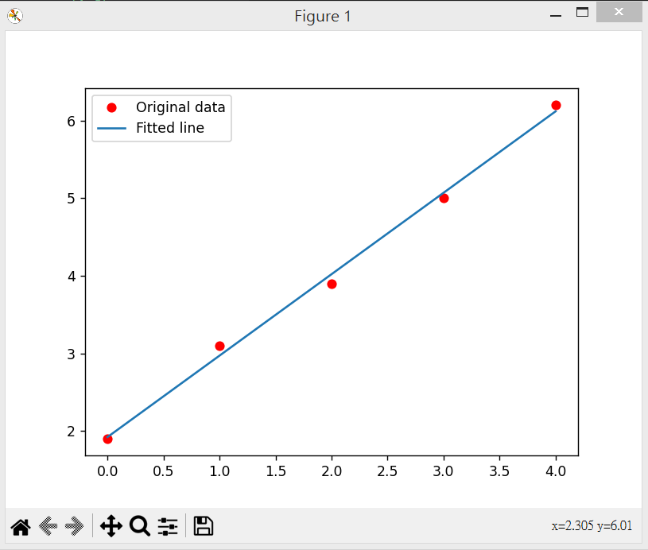

# gdRegression.py -- 用梯度下降法尋找迴歸線

gdRegression.py 這個程式想找出一組 (x,y) 資料的回歸線 $y=a_0 x + a_1$ 之參數值 $[a_0,a_1]$

結果會找出下圖中的回歸線，你可以看到和資料擬合得很好



我們使用的方法是梯度下降法，採用以下的《最小平方法》作為損失函數！

$$
\sum_{1}^{n} (y_i - (a_0 x_i + a_1))
$$

## 執行結果

```
$ python gdRegression.py
00000:f(p)=91.870 p=[0.00000 0.00000] gp=[ -40.19500 -101.37000] glen=109.04822
00050:f(p)=0.252 p=[1.56693 1.17338] gp=[-1.05817  0.37119] glen=1.12138
00100:f(p)=0.056 p=[1.83062 1.08088] gp=[-0.27123  0.09514] glen=0.28743
00150:f(p)=0.044 p=[1.89821 1.05717] gp=[-0.06952  0.02439] glen=0.07367
00200:f(p)=0.043 p=[1.91553 1.05109] gp=[-0.01782  0.00625] glen=0.01888
00250:f(p)=0.043 p=[1.91997 1.04954] gp=[-0.00457  0.00160] glen=0.00484
00300:f(p)=0.043 p=[1.92111 1.04914] gp=[-0.00117  0.00041] glen=0.00124
00350:f(p)=0.043 p=[1.92140 1.04904] gp=[-0.00030  0.00011] glen=0.00032
00400:f(p)=0.043 p=[1.92147 1.04901] gp=[-0.00008  0.00003] glen=0.00008
00450:f(p)=0.043 p=[1.92149 1.04900] gp=[-0.00002  0.00001] glen=0.00002
00478:f(p)=0.043 p=[1.92150 1.04900] gp=[-0.00001  0.00000] glen=0.00001
y_predicted= [1.92150 2.97050 4.01950 5.06850 6.11750]
```