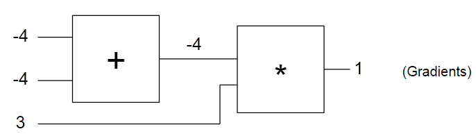

# ex0.py -- micrograd 梯度反傳遞的示範

* 程式 -- [ex0.py](ex0.py)

正向傳遞計算求 value


反向傳遞計算求 grad



## 執行結果

```
$ python ex0.py
====== forward ======
x= Value(data=-2.0, grad=0)
y= Value(data=5.0, grad=0)
z= Value(data=-4.0, grad=0)
q= Value(data=3.0, grad=0)
f= Value(data=-12.0, grad=0)
====== backward ======
x= Value(data=-2.0, grad=-4.0)
y= Value(data=5.0, grad=-4.0)
z= Value(data=-4.0, grad=3.0)
q= Value(data=3.0, grad=-4.0)
f= Value(data=-12.0, grad=1)
```
