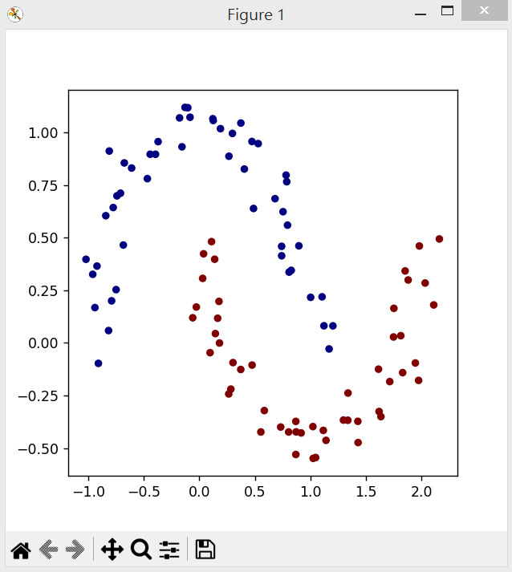
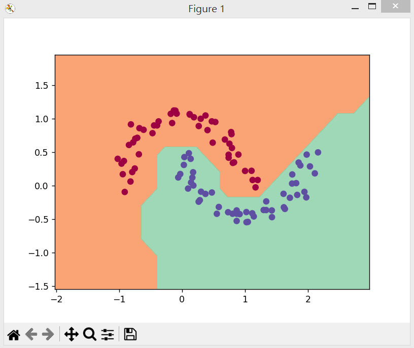

# demo.py

* 程式 -- [demo.py](demo.py)

學習兩個月彎形資料的分類，盡量將兩個月彎的資料分開。

## 需要被區分的資料



## 學習過程與結果

```
$ python demo.py
MLP of [Layer of [ReLUNeuron(2), ReLUNeuron(2), ReLUNeuron(2), ReLUNeuron(2), ReLUNeuron(2), ReLUNeuron(2), ReLUNeuron(2), ReLUNeuron(2), ReLUNeuron(2), ReLUNeuron(2), ReLUNeuron(2), ReLUNeuron(2), ReLUNeuron(2), ReLUNeuron(2), ReLUNeuron(2), ReLUNeuron(2)], Layer of [ReLUNeuron(16), ReLUNeuron(16), ReLUNeuron(16), ReLUNeuron(16), ReLUNeuron(16), ReLUNeuron(16), ReLUNeuron(16), ReLUNeuron(16), ReLUNeuron(16), ReLUNeuron(16), ReLUNeuron(16), ReLUNeuron(16), ReLUNeuron(16), ReLUNeuron(16), ReLUNeuron(16), ReLUNeuron(16)], Layer of [LinearNeuron(16)]]
number of parameters 337
Value(data=0.8862514464368222, grad=0) 0.5
step 0 loss 0.8862514464368222, accuracy 50.0%
step 1 loss 1.7136790633950052, accuracy 81.0%
step 2 loss 0.733396126728699, accuracy 77.0%
step 3 loss 0.7615247055858604, accuracy 82.0%
step 4 loss 0.359780833345342, accuracy 84.0%
step 5 loss 0.3039360355411296, accuracy 86.0%
step 6 loss 0.2716587340549048, accuracy 89.0%
step 7 loss 0.258965768030132, accuracy 91.0%
step 8 loss 0.24684455035335176, accuracy 91.0%
step 9 loss 0.26038987927745966, accuracy 91.0%
step 10 loss 0.2356971004730653, accuracy 91.0%
step 11 loss 0.2403768930229477, accuracy 92.0%
step 12 loss 0.20603128479123117, accuracy 91.0%
step 13 loss 0.22061157796029196, accuracy 93.0%
step 14 loss 0.19010711228374733, accuracy 92.0%
step 15 loss 0.21687609382796408, accuracy 93.0%
step 16 loss 0.1864244534217525, accuracy 92.0%
step 17 loss 0.20644781960886666, accuracy 92.0%
step 18 loss 0.1529979310218965, accuracy 94.0%
step 19 loss 0.18164592701596197, accuracy 93.0%
step 20 loss 0.15209012673698666, accuracy 92.0%
step 21 loss 0.17985784886850317, accuracy 93.0%
step 22 loss 0.13186703020683815, accuracy 95.0%
step 23 loss 0.13971668862318978, accuracy 95.0%
step 24 loss 0.10529877326270476, accuracy 96.0%
step 25 loss 0.11575214222251128, accuracy 95.0%
step 26 loss 0.10138692709798283, accuracy 97.0%
step 27 loss 0.1398324999052206, accuracy 95.0%
step 28 loss 0.13439433831552547, accuracy 92.0%
step 29 loss 0.149464911997538, accuracy 95.0%
step 30 loss 0.08058651087395291, accuracy 97.0%
step 31 loss 0.08894402478347961, accuracy 97.0%
step 32 loss 0.1484617162877052, accuracy 95.0%
step 33 loss 0.08534324122933531, accuracy 97.0%
step 34 loss 0.06930425973662234, accuracy 97.0%
step 35 loss 0.10224309625633379, accuracy 95.0%
step 36 loss 0.05690038135075193, accuracy 97.0%
step 37 loss 0.04361190103707669, accuracy 97.0%
step 38 loss 0.04085954349889361, accuracy 98.0%
step 39 loss 0.061158607936475616, accuracy 97.0%
step 40 loss 0.0671260527436872, accuracy 99.0%
step 41 loss 0.10077765359387977, accuracy 95.0%
step 42 loss 0.04721961568432389, accuracy 97.0%
step 43 loss 0.03229533112572592, accuracy 99.0%
step 44 loss 0.028346610758982413, accuracy 99.0%
step 45 loss 0.05011775341000797, accuracy 99.0%
step 46 loss 0.0932163415073765, accuracy 96.0%
step 47 loss 0.05585957556955357, accuracy 98.0%
step 48 loss 0.02709965160774588, accuracy 99.0%
step 49 loss 0.054945465674614925, accuracy 98.0%
step 50 loss 0.0733577593940534, accuracy 97.0%
step 51 loss 0.029363076775347816, accuracy 99.0%
step 52 loss 0.027406874198163553, accuracy 100.0%
step 53 loss 0.053569301279996644, accuracy 97.0%
step 54 loss 0.025878489830786857, accuracy 99.0%
step 55 loss 0.014472674211810978, accuracy 100.0%
step 56 loss 0.01837224647276512, accuracy 100.0%
step 57 loss 0.024120401273881723, accuracy 100.0%
step 58 loss 0.042104515290840076, accuracy 97.0%
step 59 loss 0.020190767489584253, accuracy 99.0%
step 60 loss 0.013597924359035425, accuracy 100.0%
step 61 loss 0.020736759057606392, accuracy 99.0%
step 62 loss 0.009426482593917094, accuracy 100.0%
step 63 loss 0.019576446724346604, accuracy 99.0%
step 64 loss 0.0069012051309027345, accuracy 100.0%
step 65 loss 0.008163773764319685, accuracy 100.0%
step 66 loss 0.017780151200259834, accuracy 99.0%
step 67 loss 0.006078102632656913, accuracy 100.0%
step 68 loss 0.005207081013904716, accuracy 100.0%
step 69 loss 0.0065149568524284635, accuracy 100.0%
step 70 loss 0.013680146079091628, accuracy 100.0%
step 71 loss 0.004260189369690954, accuracy 100.0%
step 72 loss 0.003571447732386227, accuracy 100.0%
step 73 loss 0.002785643637841213, accuracy 100.0%
step 74 loss 0.004165352019028104, accuracy 100.0%
step 75 loss 0.01004700257275151, accuracy 100.0%
step 76 loss 0.0021763263861155225, accuracy 100.0%
step 77 loss 0.0013429141412181168, accuracy 100.0%
step 78 loss 0.0015998647806399402, accuracy 100.0%
step 79 loss 0.013899827335824375, accuracy 100.0%
step 80 loss 0.003571278561142186, accuracy 100.0%
step 81 loss 0.0009515333042032781, accuracy 100.0%
step 82 loss 0.0018646068068751632, accuracy 100.0%
step 83 loss 0.004625721678128829, accuracy 100.0%
step 84 loss 0.002288394766731703, accuracy 100.0%
step 85 loss 0.00013159190449584467, accuracy 100.0%
step 86 loss 0.0019800360839904883, accuracy 100.0%
step 87 loss 0.005689619877166714, accuracy 100.0%
step 88 loss 0.0011989843931981758, accuracy 100.0%
step 89 loss 0.0002145080012556988, accuracy 100.0%
step 90 loss 0.00039275732969061615, accuracy 100.0%
step 91 loss 0.00044397032667488177, accuracy 100.0%
step 92 loss 0.0, accuracy 100.0%
step 93 loss 0.0, accuracy 100.0%
step 94 loss 0.0, accuracy 100.0%
step 95 loss 0.0, accuracy 100.0%
step 96 loss 0.0, accuracy 100.0%
step 97 loss 0.0, accuracy 100.0%
step 98 loss 0.0, accuracy 100.0%
step 99 loss 0.0, accuracy 100.0%
```

