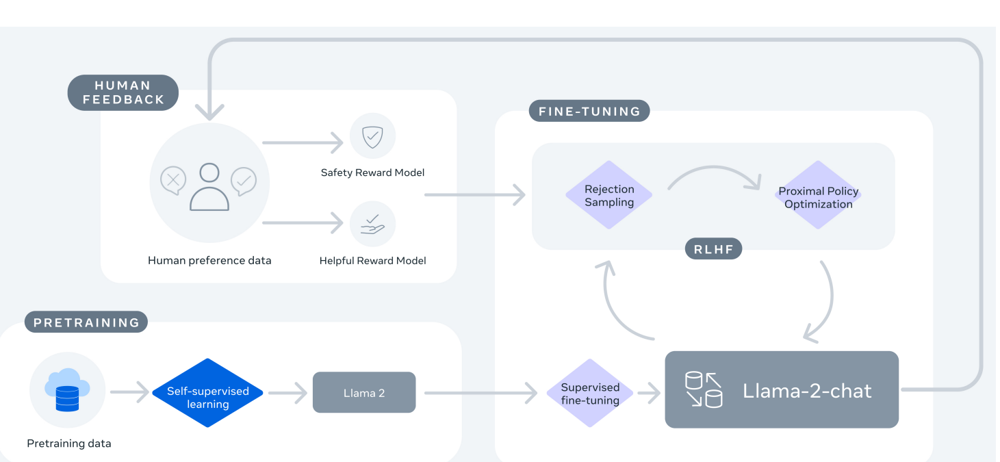

# LLAMA2

* [Llama 2: Open Foundation and Fine-Tuned Chat Models](https://arxiv.org/pdf/2307.09288.pdf)
    * https://ai.meta.com/research/publications/llama-2-open-foundation-and-fine-tuned-chat-models/

HuggingFace 的 LLAMA2

* 模型
    * https://huggingface.co/blog/llama2
* Llama2 70B 線上使用
    * https://huggingface.co/spaces/ysharma/Explore_llamav2_with_TGI (失敗)
* Llama2 7B 線上使用
    * https://huggingface.co/spaces/huggingface-projects/llama-2-7b-chat
    * 甚麼是 GPT ? 請用中文回答 (會回應一句中文，其他則是英文)

HuggingFace 的 LLAMA2 實作是基於 neox

* https://github.com/EleutherAI/gpt-neox

neox 是基於 nvidia 的 Megatron

* https://github.com/NVIDIA/Megatron-LM

這個 Transformer Layer Block 就是 minGPT 中的那個

## LLAMA 到底釋出了甚麼？

根據以下報告書，應該是釋出了訓練資料和程式，包含

1. Pretraining Data
2. Training Data
3. Fine Tuning Data
4. Code

## 整體訓練架構

Figure 4: Training of Llama 2-Chat: This process begins with the pretraining of Llama 2 using publicly available online sources. Following this, we create an initial version of Llama 2-Chat through the application of supervised fine-tuning. Subsequently, the model is iteratively refined using Reinforcement Learning with Human Feedback (RLHF) methodologies, specifically through rejection sampling and Proximal Policy Optimization (PPO). Throughout the RLHF stage, the accumulation of iterative reward modeling data in
parallel with model enhancements is crucial to ensure the reward models remain within istribution.
