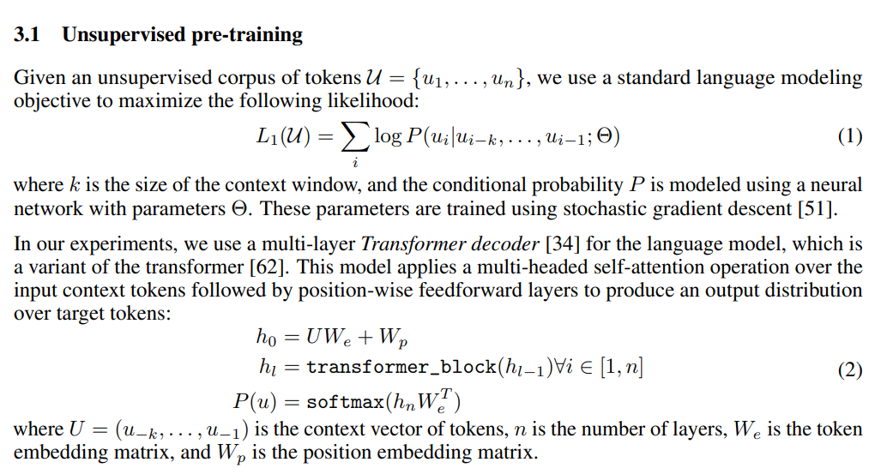
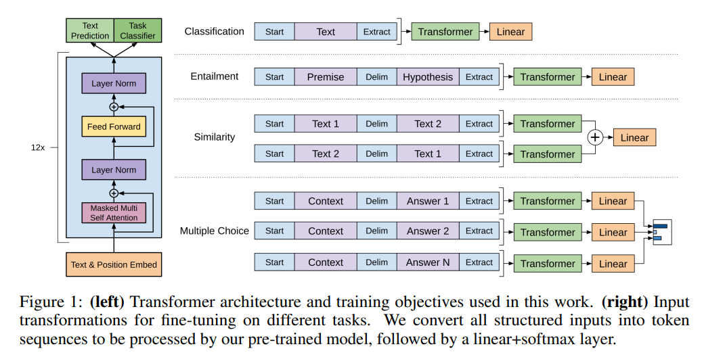
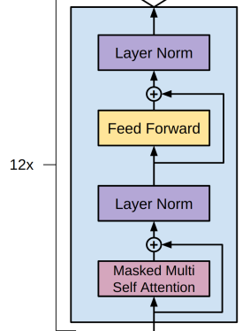
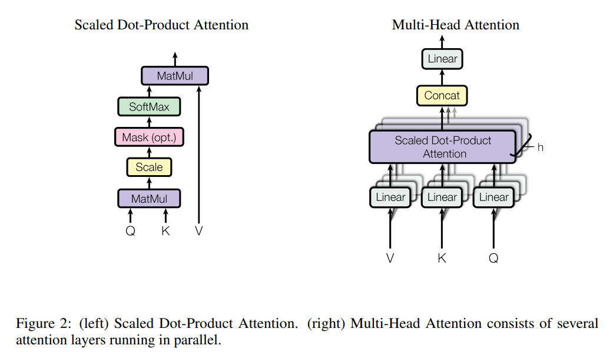

# minGPT 導讀

## 參考論文

* [Improving Language Understanding by Generative Pre-Training](https://cdn.openai.com/research-covers/language-unsupervised/language_understanding_paper.pdf) (GPT1)
* [Language Models are Unsupervised Multitask Learners](https://cdn.openai.com/better-language-models/language_models_are_unsupervised_multitask_learners.pdf) (GPT2)
* [Attention Is All You Need](https://arxiv.org/abs/1706.03762)

## minGPT 的數學公式



## minGPT 的模型架構



## minGPT 專案的檔案列表

* [demo.ipynb](demo.ipynb) : 學習排序 sorting 的範例 => ccc 改為 demo.py 在命令列執行
* [generate.ipynb](generate.ipynb) : 載入 gpt2-xl 模型，測試看看會如何接著 Andrej Karpathy, the ... 寫下來。 
* mingpt/
    * bpe.py : 將 utf-8 轉為對應的整數代號
    * model.py: transformer 的神經網路模組
    * trainer.py: 通用的反傳遞訓練模組
    * util.py: 函式庫
* projects/:
    * adder/ : 用 GPT 學加法的範例
    * chargpt/ : 讚！以字元為單位，學習任何語料的模型 (模仿其寫法) 
    * 我修改過後的 [chargpt.py](chargpt.py) 與其 [執行結果](chargpt.md) (原本輸入固定為莎士比亞，我改成可以指定輸入的語料 corpus 名稱)
* tests/:
    * test_huggingface_import: 測試能否從 huggingface 的 transformers 引用模型
    * model = GPT.from_pretrained(model_type) 和 model_hf = GPT2LMHeadModel.from_pretrained(model_type) 是否一樣

## minGPT 的整體用法

Here's how you'd instantiate a GPT-2 (124M param version):

```python
from mingpt.model import GPT
model_config = GPT.get_default_config()
model_config.model_type = 'gpt2'
model_config.vocab_size = 50257 # openai's model vocabulary
model_config.block_size = 1024  # openai's model block_size (i.e. input context length)
model = GPT(model_config)
```

And here's how you'd train it:

```python
# your subclass of torch.utils.data.Dataset that emits example
# torch LongTensor of lengths up to 1024, with integers from [0,50257)
train_dataset = YourDataset()

from mingpt.trainer import Trainer
train_config = Trainer.get_default_config()
train_config.learning_rate = 5e-4 # many possible options, see the file
train_config.max_iters = 1000
train_config.batch_size = 32
trainer = Trainer(train_config, model, train_dataset)
trainer.run()
```

## 準備訓練資料 -- 創建自己的 Dataset 物件

在 minGPT 當中，幾乎對每個訓練範例都定義了自己的 Dataset ，例如 chargpt.py / demo.ipynb ，這些 dataset 只要覆蓋掉 `__getitem__()` 和 `__len__()` 這兩個函數，就能讓 minGPT 的 Trainer 正確取得資料去訓練。

Dataset

* [CLASS torch.utils.data.Dataset(*args, **kwds)](https://pytorch.org/docs/stable/data.html#torch.utils.data.Dataset)
    * An abstract class representing a Dataset.
    * All datasets that represent a map from keys to data samples should subclass it. All subclasses should overwrite __getitem__(), supporting fetching a data sample for a given key. Subclasses could also optionally overwrite __len__(), which is expected to return the size of the dataset by many Sampler implementations and the default options of DataLoader.

CharGPT 中的 CharDataset

```py
class CharDataset(Dataset):
    # ...
    def __init__(self, config, data):
        self.config = config

        chars = sorted(list(set(data)))
        data_size, vocab_size = len(data), len(chars)
        print('data has %d characters, %d unique.' % (data_size, vocab_size))

        self.stoi = { ch:i for i,ch in enumerate(chars) }
        self.itos = { i:ch for i,ch in enumerate(chars) }
        self.vocab_size = vocab_size
        self.data = data

    # ...
    def __len__(self):
        return len(self.data) - self.config.block_size

    def __getitem__(self, idx):
        # grab a chunk of (block_size + 1) characters from the data
        chunk = self.data[idx:idx + self.config.block_size + 1]
        # encode every character to an integer
        dix = [self.stoi[s] for s in chunk]
        # return as tensors
        x = torch.tensor(dix[:-1], dtype=torch.long)
        y = torch.tensor(dix[1:], dtype=torch.long)
        return x, y
```

這樣才能在 trainer 中將 dataset 傳進去，循環取得資料進行訓練

```py
    train_dataset = CharDataset(config.data, text)
    # ...
    model = GPT(config.model)

    # construct the trainer object
    trainer = Trainer(config.trainer, model, train_dataset)
```

demo.ipynb 中的 SortDataset

```py
class SortDataset(Dataset):
    """ 
    Dataset for the Sort problem. E.g. for problem length 6:
    Input: 0 0 2 1 0 1 -> Output: 0 0 0 1 1 2
    Which will feed into the transformer concatenated as:
    input:  0 0 2 1 0 1 0 0 0 1 1
    output: I I I I I 0 0 0 1 1 2
    where I is "ignore", as the transformer is reading the input sequence
    """

    def __init__(self, split, length=6, num_digits=3):
        assert split in {'train', 'test'}
        self.split = split
        self.length = length
        self.num_digits = num_digits
    
    def __len__(self):
        return 10000 # ...
    
    def get_vocab_size(self):
        return self.num_digits
    
    def get_block_size(self):
        # the length of the sequence that will feed into transformer, 
        # containing concatenated input and the output, but -1 because
        # the transformer starts making predictions at the last input element
        return self.length * 2 - 1

    def __getitem__(self, idx):
        
        # use rejection sampling to generate an input example from the desired split
        while True:
            # generate some random integers
            inp = torch.randint(self.num_digits, size=(self.length,), dtype=torch.long)
            # half of the time let's try to boost the number of examples that 
            # have a large number of repeats, as this is what the model seems to struggle
            # with later in training, and they are kind of rate
            if torch.rand(1).item() < 0.5:
                if inp.unique().nelement() > self.length // 2:
                    # too many unqiue digits, re-sample
                    continue
            # figure out if this generated example is train or test based on its hash
            h = hash(pickle.dumps(inp.tolist()))
            inp_split = 'test' if h % 4 == 0 else 'train' # designate 25% of examples as test
            if inp_split == self.split:
                break # ok
        
        # solve the task: i.e. sort
        sol = torch.sort(inp)[0]

        # concatenate the problem specification and the solution
        cat = torch.cat((inp, sol), dim=0)

        # the inputs to the transformer will be the offset sequence
        x = cat[:-1].clone()
        y = cat[1:].clone()
        # we only want to predict at output locations, mask out the loss at the input locations
        y[:self.length-1] = -1
        return x, y
```

這樣才能在 trainer 中將 dataset 傳進去，循環取得資料進行訓練

```py
train_dataset = SortDataset('train')
test_dataset = SortDataset('test')
# ...
trainer = Trainer(train_config, model, train_dataset)
trainer.run()
```

## 核心 -- minGPT 模型實作

GPT 模型的程式實作在 [mingpt/model.py](mingpt/model.py) 裡面，預設支援下列模型

```py
class GPT(nn.Module):
    def get_default_config():
        # ...
    def __init__(self, config):
        # ....
        if type_given:
            # translate from model_type to detailed configuration
            config.merge_from_dict({
                # names follow the huggingface naming conventions
                # GPT-1
                'openai-gpt':   dict(n_layer=12, n_head=12, n_embd=768),  # 117M params
                # GPT-2 configs
                'gpt2':         dict(n_layer=12, n_head=12, n_embd=768),  # 124M params
                'gpt2-medium':  dict(n_layer=24, n_head=16, n_embd=1024), # 350M params
                'gpt2-large':   dict(n_layer=36, n_head=20, n_embd=1280), # 774M params
                'gpt2-xl':      dict(n_layer=48, n_head=25, n_embd=1600), # 1558M params
                # Gophers
                'gopher-44m':   dict(n_layer=8, n_head=16, n_embd=512),
                # (there are a number more...)
                # I made these tiny models up
                'gpt-mini':     dict(n_layer=6, n_head=6, n_embd=192),
                'gpt-micro':    dict(n_layer=4, n_head=4, n_embd=128),
                'gpt-nano':     dict(n_layer=3, n_head=3, n_embd=48),
            }[config.model_type])

        self.transformer = nn.ModuleDict(dict(
            wte = nn.Embedding(config.vocab_size, config.n_embd), # W[t,e]: token => embed
            wpe = nn.Embedding(config.block_size, config.n_embd), # W[p,e]: pos => embed
            # 注意，詞彙 voc 轉成 embed ，位置 pos 也轉成 embed ，然後才相加 (不是直接把 pos 和 voc.embed 相加)
            drop = nn.Dropout(config.embd_pdrop),
            h = nn.ModuleList([Block(config) for _ in range(config.n_layer)]), # 很多 Block 疊加
            ln_f = nn.LayerNorm(config.n_embd),
        ))
        # transformer = { wte:.., wpe:.., drop:.., h:.., ln_f:.. }
        self.lm_head = nn.Linear(config.n_embd, config.vocab_size, bias=False) # 將 embed 轉回 voc 的向量 (類似 one-hot，但不是只有 0, 1)

        # ...
    def _init_weights(self, module): 
        # ...
    def from_pretrained(cls, model_type):
        # ...
    def configure_optimizers(self, train_config):
        # ...
    def forward(self, idx, targets=None):
        # ...
        pos = torch.arange(0, t, dtype=torch.long, device=device).unsqueeze(0) # shape (1, t)
        # 這裡看來 pos 不是浮點數，是 int64 (所以不是 Attention is all you need 的論文中用 sin, cos 的方式?)
        #   參看 https://pytorch.org/docs/stable/generated/torch.Tensor.long.html
        # forward the GPT model itself
        tok_emb = self.transformer.wte(idx) # token embeddings of shape (b, t, n_embd)
        pos_emb = self.transformer.wpe(pos) # position embeddings of shape (1, t, n_embd)
        x = self.transformer.drop(tok_emb + pos_emb) # 參考 [不同維度張量相加]
        for block in self.transformer.h: # 有 h 層 block
            x = block(x) # 每層的輸出 x 都是  (b, t, n_embd) 大小
        x = self.transformer.ln_f(x)
        logits = self.lm_head(x) # block 每層輸出都是 (b, t, n_embd) ，但最後只取

        # if we are given some desired targets also calculate the loss
        loss = None
        if targets is not None:
            loss = F.cross_entropy(logits.view(-1, logits.size(-1)), targets.view(-1), ignore_index=-1)

        return logits, loss

    '''
    對於 'gpt-nano': dict(n_layer=3, n_head=3, n_embd=48), 以上的變數 size 為

    idx.size()= torch.Size([64, 128])
    pos.size()= torch.Size([1, 128])
    tok_emb.size()= torch.Size([64, 128, 48])
    pos_emb.size()= torch.Size([1, 128, 48])
    x.size()= torch.Size([64, 128, 48])
    x.size()= torch.Size([64, 128, 48])
    logits.size()= torch.Size([64, 128, 20]) # 希望還原後，每個 vocab 都對。
    loss= tensor(2.9857, grad_fn=<NllLossBackward0>)

    其中的 (batch_size=64, block_size=128, n_embed=48, vocab_size=20)
    '''

    def generate(self, idx, max_new_tokens, temperature=1.0, do_sample=False, top_k=None):
        # ...
```

## minGPT 的基本 Block



```py
class Block(nn.Module): # 
    """ an unassuming Transformer block """

    def __init__(self, config):
        super().__init__()
        self.ln_1 = nn.LayerNorm(config.n_embd)
        self.attn = CausalSelfAttention(config)
        self.ln_2 = nn.LayerNorm(config.n_embd)
        self.mlp = nn.ModuleDict(dict(                             # MLP Forward 層
            c_fc    = nn.Linear(config.n_embd, 4 * config.n_embd), #   先從 n_embed 轉成 4*n_embd 擴大
            c_proj  = nn.Linear(4 * config.n_embd, config.n_embd), #   最後又從 4*n_embd 轉回 n_embd 縮小
            act     = NewGELU(),                                   #   中間經過 GELU (門檻以下削去)
            dropout = nn.Dropout(config.resid_pdrop),              #   加入 dropout 增加容錯性
        ))
        m = self.mlp
        self.mlpf = lambda x: m.dropout(m.c_proj(m.act(m.c_fc(x)))) # MLP forward

    def forward(self, x): # Block = Attention + LayerNorm1 + MLP Forward + LayerNorm2
        x = x + self.attn(self.ln_1(x)) # Transformer 論文上的圖，感覺是 x = self.ln_1(x+self.attn(x)) ，是否做錯了?
        x = x + self.mlpf(self.ln_2(x)) # Transformer 論文上的圖，感覺是 x = self.ln_2(x+self.mlpf(x)) ，是否做錯了?
        return x
```

## minGPT 的 Attention 實作

```py
class CausalSelfAttention(nn.Module):
    """
    A vanilla multi-head masked self-attention layer with a projection at the end.
    It is possible to use torch.nn.MultiheadAttention here but I am including an
    explicit implementation here to show that there is nothing too scary here.
    """

    def __init__(self, config):
        super().__init__()
        assert config.n_embd % config.n_head == 0
        # key, query, value projections for all heads, but in a batch
        self.c_attn = nn.Linear(config.n_embd, 3 * config.n_embd)
        # output projection
        self.c_proj = nn.Linear(config.n_embd, config.n_embd)
        # regularization
        self.attn_dropout = nn.Dropout(config.attn_pdrop)
        self.resid_dropout = nn.Dropout(config.resid_pdrop)
        # causal mask to ensure that attention is only applied to the left in the input sequence
        self.register_buffer("bias", torch.tril(torch.ones(config.block_size, config.block_size))
                                     .view(1, 1, config.block_size, config.block_size))
        self.n_head = config.n_head
        self.n_embd = config.n_embd

    def forward(self, x):
        B, T, C = x.size() # batch size, sequence length, embedding dimensionality (n_embd)

        # calculate query, key, values for all heads in batch and move head forward to be the batch dim
        q, k ,v  = self.c_attn(x).split(self.n_embd, dim=2) # q:query, k:key, v:value
        # 以下用 view 去 reshape 變成有多個頭，並用 transpose 將 1,2 維交換
        #   nh:number of heads, hs:head size?
        k = k.view(B, T, self.n_head, C // self.n_head).transpose(1, 2) # (B, nh, T, hs)
        q = q.view(B, T, self.n_head, C // self.n_head).transpose(1, 2) # (B, nh, T, hs)
        v = v.view(B, T, self.n_head, C // self.n_head).transpose(1, 2) # (B, nh, T, hs)

        # causal self-attention; Self-attend: (B, nh, T, hs) x (B, nh, hs, T) -> (B, nh, T, T)
        att = (q @ k.transpose(-2, -1)) * (1.0 / math.sqrt(k.size(-1))) # 1. x = q.matmul(tr(k))/sqrt(T)
        att = att.masked_fill(self.bias[:,:,:T,:T] == 0, float('-inf')) # 2. x = masked(x)
        att = F.softmax(att, dim=-1)                                    # 3. x = softmax(x)
        att = self.attn_dropout(att)
        y = att @ v # (B, nh, T, T) x (B, nh, T, hs) -> (B, nh, T, hs)  # 4. x = matmul(x, v)
        y = y.transpose(1, 2).contiguous().view(B, T, C) # re-assemble all head outputs side by side # 再次轉回 (B,T,C) 的大小

        # output projection
        y = self.resid_dropout(self.c_proj(y)) # c_proj:nn.Linear(config.n_embd, config.n_embd)
        # 雖然 y 是 (B,T,C) 的大小，但 c_proj 這類的 Linear 層會對每個 C 大小的向量去做 (C, C) 的轉換。
        return y
```

請將 forward() 的程式對照下圖閱讀



## 我的疑問與解答

1. position 經過 wte 轉換成 embed， position 的輸入是個浮點數嗎？
    * 看程式碼內容 pos = torch.arange(0, t, dtype=torch.long, device=device).unsqueeze(0) 應該是整數，也就是 0,1,2....,t-1 ，這和 Attention is all you need 的論文中用 sin, cos 不同。
2. GPT Block 的輸入輸出是甚麼？
    * 是 B, T, C = x.size() # batch size, sequence length, embedding dimensionality (n_embd)
    * 所以必須準備 (T,C) 這樣維度的輸入，以及得到同樣 (T,C) 維度的輸出。
    * 因此在 demo.ipynb 中，用 GPT 來學習排序是可能的，因為序列的長度是 T。
3. 不同維度的張量可以相加嗎?
    * 可以 -- https://stackoverflow.com/questions/42214228/adding-matrices-with-different-dimensions

    In numpy and tensorflow it's possible to add matrices (or tensors) of different dimensionality if the shape of smaller matrix is a suffix of bigger matrix. This is an example:

    ```py
    x = np.ndarray(shape=(10, 7, 5), dtype = float)
    y = np.ndarray(shape=(7, 5), dtype = float)
    For these two matrices operation x+y is a shortcut for:

    for a in range(10):
        for b in range(7):
            for b in range(5):
                result[a,b,c] = x[a,b,c] + y[b,c]
    ```

