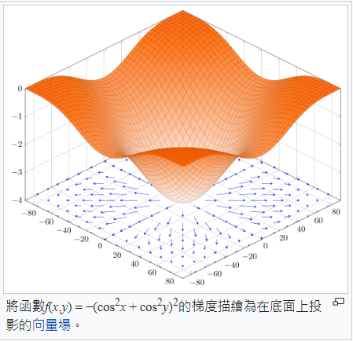

# 梯度下降法

* [Gradient Descent - THE MATH YOU SHOULD KNOW](https://www.youtube.com/watch?v=-p1ldISb90Q)

深度學習 (Deep Learning) 是人工智慧領域當紅的技術，說穿了其實就是原本的《神經網路》(Neural Network) ，不過由於加上了一些新的模型 (像是捲積神經網路 CNN, 循環神經網路 RNN 與生成對抗網路 GAN)，還有在神經網路的層數上加深很多，從以往的 3-4 層，提升到了十幾層，甚至上百層，於是我們給這些新一代的《神經網路》技術一個統稱，那就是《深度學習》。

雖然《深度學習》的神經網路層數變多了，《網路模型》也多了一些，但是背後的學習算法和運作原理並沒有多大改變，仍然是以《梯度下降》(Gradient Descendent) 和《反傳遞算法》(Back Propagation) 為主。

但是《梯度下降》和《反傳遞算法》兩者，幾乎都是以數學的形式呈現，其中《梯度》的數學定義如下：

$$
\nabla_{x} f(x) = \left[ \frac{\partial }{\partial x_1} f(x), \frac{\partial }{\partial x_2} f(x),\cdots,\frac{\partial }{\partial x_n} f(x) \right]^T=\frac{\partial }{\partial{x}} f(x)
$$

若把《梯度》當成一個《巨型算子》可以寫為如下形式：

$$
\nabla_{x} = \left[ \frac{\partial }{\partial x_1}, \frac{\partial }{\partial x_2},\cdots,\frac{\partial }{\partial x_n} \right]^T=\frac{\partial }{\partial{x}}
$$

這樣的數學雖然只是《基本的偏微分》，但是卻足以嚇倒很多人，包括我在內！

《反傳遞算法》的運作原理，則是建築在《微積分的鏈鎖規則》上，如以下算式所示：

$$
\frac{\partial{f(q,z)}}{\partial{x}} = \frac{\partial{q(x,y)}}{\partial{x}} \frac{\partial{f(q,z)}}{\partial{q}}
$$

根據這兩個數學式，人工智慧領域發展出了一整套《神經網路訓練算法》，稱為《反傳遞算法》，可以用來訓練《神經網路》，讓程式可以具有《函數優化》的能力。

有了函數優化的能力，程式就能向《一群樣本與解答》學習，優化《解答的能力》，進而解決《手寫辨識、語音辨識、影像辨識》甚至是《機器翻譯》等問題。

如果我們有個函數能計算《錯誤率》，那麼透過《優化算法》，我們就能找到讓錯誤率很低的函數，這個錯誤率很低的函數，就很少會在《訓練學習樣本》上回答錯誤。

如果這個函數還具有《通用延展性》，也就是在《非學習樣本上》也表現得同樣良好，那麼這個函數基本上就解決了該問題。

在本文中，我們將從《梯度下降法》開始，讓熟悉程式的人能夠輕易的透過《程式》來理解《深度學習背後的那些數學》！

## 梯度

如前所述，《梯度》的數學定義如下：

$$
\nabla_{x} f(x) = \left[ \frac{\partial }{\partial x_1} f(x), \frac{\partial }{\partial x_2} f(x),\cdots,\frac{\partial }{\partial x_n} f(x) \right]^T=\frac{\partial }{\partial{x}} f(x)
$$

問題是、這樣的數學符號對程式人有點可怕，到底梯度有甚麼直覺意義呢？讓我們看看下圖：




其實梯度就是斜率最大的那個方向，所以梯度下降法，其實就是朝著斜率最大的方向走。

如果我們朝著《斜率最大》方向的《正梯度》走，那麼就會愈走愈高，但是如果朝著《逆梯度》方向走，那麼就會愈走愈低。

而梯度下降法，就是朝著《逆梯度》的方向走，於是就可以不斷下降，直到到達梯度為 0 的點 (斜率最大的方向仍然是斜率為零)，此時就已經到了一個《谷底》，也就是區域的最低點了！

理解了這個直覺概念之後，我們的下一個問題是，如何用程式來計算《梯度》呢？

其實、很多數學只要回到基本定義，就一點都不可怕了！

讓我們先回頭看看梯度中的基本元素，也就是偏微分，其定義是：

$$
\frac{\partial }{\partial x_1} f(x) = \lim_{h \to 0} \frac{f(x_1, ..., x_i+h, ...., x_n)-f(x_1, ..., x_i, ...., x_n)}{h}
$$

舉例而言，假如對 $`f(x,y) = x^2+y^2`$  這個函數而言，其對 x 的偏微分就是：

$$
\frac{\partial }{\partial x} f(x,y) = \lim_{h \to 0} \frac{f(x+h,y)-f(x,y)}{h}
$$

而對 y 的偏微分就是：

$$
\frac{\partial }{\partial y} f(x,y) = \lim_{h \to 0} \frac{f(x,y+h)-f(x,y)}{h}
$$

於是我們可以寫一個函數 df 來計算偏微分：

```py
# 函數 f 對變數 k 的偏微分: df / dk
def df(f, p, k, step=0.01):
    p1 = p.copy()
    p1[k] = p[k]+step
    return (f(p1) - f(p)) / step
```

這樣我們就可以用下列指令計算出 f(x,y) 在 (1,1) 這點的偏導數：

```py
p = [1.0, 1.0]
print('nn.df(f, p, 0) = ', nn.df(f, p, 0))
```

只要我們對每個變數都取偏導數，然後形成一個向量，就能計算出《梯度》了！ 其 python 程式如下：

```py
# 函數 f 在點 p 上的梯度
def grad(f, p, step=0.01):
    gp = p.copy()
    for k in range(len(p)):
        gp[k] = df(f, p, k, step)
    return gp
```

於是我們可以用 grad() 下列程式計算 f 在 (1,1) 這點的梯度。

```py
p = [1.0, 1.0]
print('grad(f,p) = ', nn.grad(f, p))
```

假如我們定義函數 f 為 $`f(x,y) = x^2+y^2`$ ，那麼 f 在 (1,1) 的梯度將會是 (2x, 2y) = (2,2)。

讓我們用程式實作一下，並驗證看看梯度的計算是否正確：

先定義函數 $`f(x,y) = x^2+y^2`$

```py
import nn

def f(p):
    [x,y] = p
    return x*x + y*y

p = [1.0, 3.0]
print('grad(f,p) = ', nn.grad(f, p))

```

然後呼叫我們的示範套件 nn，看看其計算結果是否正確：

```py
import nn

def f(p):
    [x,y] = p
    return x*x + y*y

p = [1.0, 3.0]
print('grad(f,p) = ', nn.grad(f, p))
```

執行結果如下：

```
$ python gradTest.py
grad(f,p) =  [2.009999999999934, 6.009999999999849]
```

您可以看到《偏微分與梯度》的計算，基本上都非常接近，所以是正確的。

### 梯度下降法

只要能計算梯度，那麼要實作《梯度下降法》就很容易了，我們可以呼叫上述的梯度函數 nn.grad(f, p) ，輕而易舉地設計出《梯度下降法》程式如下：

```py
# 使用梯度下降法尋找函數最低點
def gradientDescendent(f, p0, step=0.001):
    p = p0.copy()
    i = 0
    while (True):
        i += 1
        gp = grad(f, p) # 計算梯度 gp
        glen = norm(gp) # norm = 梯度的長度 (步伐大小)
        print('{:d}:p={:s} f(p)={:.3f} glen={:.3f}'.format(i, str(p), f(p), glen))
        if glen < 0.00001:  # 如果步伐已經很小了，那麼就停止吧！
            break
        # gstep = np.mul(gp, -1 * step) # gstep = 逆梯度方向的一小步
        gstep = np.multiply(gp, -1*step)
        p +=  gstep # 向 gstep 方向走一小步
    return p # 傳回最低點！
```

然後讓我們測試看看，該算法是否能找到 $`f(x,y) = x^2+y^2`$ 的最低點。

```
$ python .\gradientDescendentTest.py
1:p=[1.0, 3.0] f(p)=10.000 glen=6.337
2:p=[0.99799 2.99399] f(p)=9.960 glen=6.325
3:p=[0.99598402 2.98799202] f(p)=9.920 glen=6.312
4:p=[0.99398205 2.98200604] f(p)=9.880 glen=6.299
5:p=[0.99198409 2.97603202] f(p)=9.841 glen=6.287
6:p=[0.98999012 2.97006996] f(p)=9.801 glen=6.274
7:p=[0.98800014 2.96411982] f(p)=9.762 glen=6.262
8:p=[0.98601414 2.95818158] f(p)=9.723 glen=6.249
9:p=[0.98403211 2.95225522] f(p)=9.684 glen=6.237
..中間省略 ...
6671:p=[-0.0049984  -0.00499523] f(p)=0.000 glen=0.000
6672:p=[-0.00499841 -0.00499524] f(p)=0.000 glen=0.000
6673:p=[-0.00499841 -0.00499525] f(p)=0.000 glen=0.000
6674:p=[-0.00499841 -0.00499526] f(p)=0.000 glen=0.000
```

結果果然找到 (x,y)=(0, 0) 這個最低點的區域，因此上述的方法，基本上就已經實作出《梯度下降法》了。

以上的程式放在下列 github 專案當中，透過閱讀程式碼，您應該會進一步理解完整的程式寫法。

* https://github.com/ccccourse/ai/blob/master/python/03-neuralnet/nn.py

### 梯度下降法的缺點

以上的《梯度下降法》，是採用計算 $`\frac{f(x+h, y) - f(x, y)}{h}`$, $`\frac{f(x, y+h) - f(x, y)}{h}`$ 這樣的方式，重複呼叫 f 幾次後達成的。

假如函數 f 的參數有 n 個，那麼要算出梯度，就必須重複的呼叫 n 次以上的 f 函數，因為至少要計算 $`f(x_1+h, ....), f(x_1, x_2+h, ....), .... f(x_1, x_2, ..., x_n+h)`$ 。

這樣當參數數量 n 很大的時候，梯度的計算就會變得很慢，因此我們必須想辦法加速《梯度的計算速度》。

而《反傳遞演算法》，就是用來加速《梯度計算》的一種方法，這種方法依靠的是《自動微分》功能，想辦法從後面一層的差值，計算出前面一層應該調整的方向與大小。
