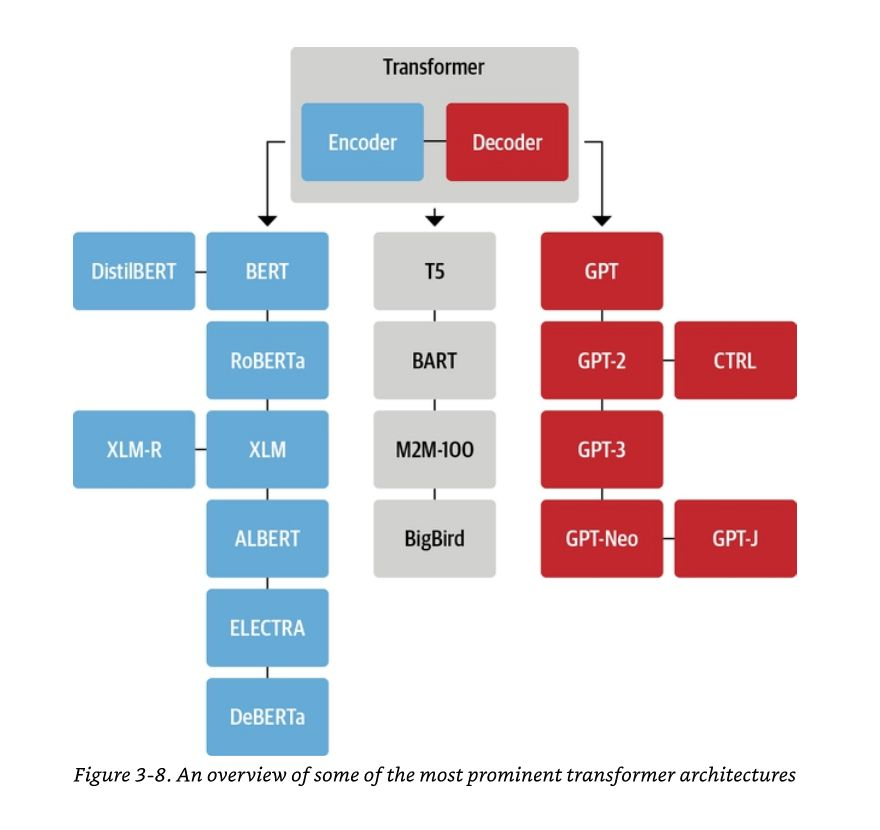
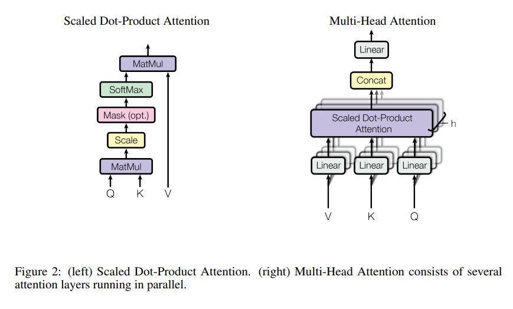

# 第四章 Transformer



https://www.facebook.com/photo/?fbid=10218547033106478&set=a.2104140142503

* https://github.com/dair-ai/Transformers-Recipe
    * [LANGUAGE MODELING WITH NN.TRANSFORMER AND TORCHTEXT](https://pytorch.org/tutorials/beginner/transformer_tutorial.html)
    * [Transformers from Scratch](https://e2eml.school/transformers.html)
    * [The Illustrated Transformer](http://jalammar.github.io/illustrated-transformer/)

* [YouTube: The A.I. Hacker - Michael Phi: Illustrated Guide to Transformers Neural Network: A step by step explanation](https://www.youtube.com/watch?v=4Bdc55j80l8) (超讚)
* [YouTube: CodeEmporium](https://www.youtube.com/@CodeEmporium/playlists) (超棒的AI教學頻道)
    * [YouTube: Transformer Neural Networks - EXPLAINED! (Attention is all you need)](https://www.youtube.com/watch?v=TQQlZhbC5ps) (讚，補充前一個影片)
    * [GPT - Explained!](https://www.youtube.com/watch?v=3IweGfgytgY)
    * [Blowing up the Transformer Encoder!](https://www.youtube.com/watch?v=QwfuoNhjbkI)
    * [Layer Normalization - EXPLAINED (in Transformer Neural Networks)](https://www.youtube.com/watch?v=G45TuC6zRf4)
    * [Blowing up Transformer Decoder architecture](https://www.youtube.com/watch?v=ekg-hoob0SM)
    * [Positional Encoding in Transformer Neural Networks Explained](https://www.youtube.com/watch?v=ZMxVe-HK174)

* [YouTube: Transformers, explained: Understand the model behind GPT, BERT, and T5](https://www.youtube.com/watch?v=SZorAJ4I-sA)

* [TRANSFORMERS FROM SCRATCH](https://peterbloem.nl/blog/transformers)
    * Code: https://github.com/pbloem/former
    * Video: https://www.youtube.com/playlist?list=PLIXJ-Sacf8u60G1TwcznBmK6rEL3gmZmV
    * [Pytorch Transformers from Scratch (Attention is all you need)](https://www.youtube.com/watch?v=U0s0f995w14)

## 4.1 Transformer的基本結構

Transformer 是一種革命性的深度學習模型，主要用於自然語言處理等序列數據的處理。其最初由 Google 在 2017 年提出，旨在解決 RNN 模型的長期依賴問題，並通過自注意力機制（self-attention mechanism）實現了比以往更好的效果。Transformer 的核心是注意力機制，它通過將輸入序列中的每個位置與其他位置進行比較，以計算出輸出序列中每個位置應該關注的重要性，從而實現輸入序列到輸出序列的映射。

----
ccc 說明:

Transformer 的結構如下圖所示


這是由 Google 的團隊在 

* Attention Is All You Need
    * https://arxiv.org/pdf/1706.03762.pdf

這篇論文中出來的架構。

後來演化為 BERT / GPT 等架構。

2018 年到 2022 年之間，BERT 聲勢較強，但在 2022 年底 ChatGPT 出來之後，我們才發現 GPT 非常厲害。

BERT 和上述的 Transformer 圖形類似，只是改為雙向，很適合用來做各種《問答，翻譯》等任務。 

GPT 只使用 Transformer 的 Encoder ，但沒用 Decoder ，因此是著重生成，而不需要標準答案。 

GPT 採用克漏字 (MLM: Masked Language Model) 和 下一句預測 (NSP: Next Sentence Prediction) 的方式訓練，只要有語料就可以了，不需要特別準備答案。

這是為何可以規模化的原因，GPT 3 有 175B 個參數，也就是 1750 億個參數，而且訓練語料超級大。
----

Transformer 的基本結構包含以下幾個部分：

1. 輸入嵌入（Input Embedding）：將輸入序列中的每個單詞轉換為向量表示。
2. 位置編碼（Positional Encoding）：引入位置信息，使模型能夠區分序列中的不同位置。
3. 多頭注意力機制（Multi-Head Attention）：通過對不同的“頭”進行注意力機制，實現多種不同的關注方式。
4. 前向網絡（Feed-Forward Network）：對多頭注意力機制的輸出進行線性變換和非線性變換，提高模型的表達能力。
5. 正則化（Regularization）：使用 Dropout 等技術避免過擬合。
6. 殘差連接（Residual Connection）：將輸入和輸出相加，保留原始信息，加速模型收斂。

Transformer 的核心在於多頭注意力機制，它可以分為三個部分：線性變換、注意力計算和合併。在線性變換中，我們將輸入向量分成多個頭，分別進行線性變換，得到多個向量。在注意力計算中，我們對每個頭的向量進行注意力計算，得到多個加權的向量。最後，我們將多個加權向量合併，得到最終的輸出向量。

Transformer 模型通常由多個 Transformer 模塊組成，每個 Transformer 模塊由多個子層組成，包括多頭注意力機制和前向網絡，並使用殘差連接和正則化技術進行連接。

## 4.2 Transformer的注意力機制

Transformer 模型中的注意力機制是其中一個最重要的結構，它允許模型能夠選擇性地關注輸入序列中的不同部分，以便有效地進行序列建模任務。在 Transformer 中，注意力機制使用的是自注意力機制，也就是說，模型在計算注意力權重時，是基於輸入序列的不同位置計算的。



具體來說，自注意力機制會根據輸入序列中不同位置的詞彙向量，計算它們之間的相似度，然後使用這些相似度來計算注意力權重。在 Transformer 中，計算注意力權重的公式如下：

$$ \text{Attention}(Q,K,V)=\text{softmax}(\frac{QK^T}{\sqrt{d_k}})V $$

其中， $Q$ 、 $K$ 和 $V$ 分別是詞彙向量的矩陣表示， $\text{softmax}$ 函數用於計算注意力權重， $\sqrt{d_k}$ 是一個維度因子，用於調整注意力權重的標度， $^T$ 表示矩陣的轉置操作。通過計算自注意力機制，模型能夠為每個詞彙生成一個上下文相關的表示，以及將其用於輸入序列的下一步預測中。

在 Transformer 模型中，有兩種不同的注意力機制：自注意力機制和多頭注意力機制。自注意力機制用於計算輸入序列中詞彙之間的相對重要性，而多頭注意力機制則可以讓模型同時關注輸入序列中的不同子集，以提高建模的效果。

## 4.3 Transformer的訓練方法

Transformer 的訓練方法是使用自監督學習（Self-Supervised Learning）的方式進行，主要分為兩個步驟：Masked Language Model 和 Next Sentence Prediction。

### 4.3.1 Masked Language Model

在 Masked Language Model（MLM）中，模型會從一個文本序列中隨機選擇一些詞，將其用一個特殊符號  `[MASK]`  進行替換，然後讓模型去預測被替換的詞是什麼。這個過程可以促使模型學習到上下文之間的關聯，以及在缺失一些詞的情況下進行推理。

具體地，假設有一個長度為 $n$ 的文本序列 $X = {x_1, x_2, ..., x_n}$，模型會隨機選擇一些位置 $M = {m_1, m_2, ..., m_k}$，然後將這些位置的詞用  `[MASK]`  符號進行替換，得到一個新的序列 $X' = {x'_1, x'_2, ..., x'n}$，其中 $x'{m_i}= [MASK] $。

接下來，模型會將 $X'$ 輸入到 Transformer 中進行處理，得到一個新的序列 $\hat{X} = {\hat{x}_1, \hat{x}_2, ..., \hat{x}n}$，其中 $\hat{x}{m_i}$ 是模型預測出的被替換的詞。

模型的訓練目標是最小化預測詞和實際詞之間的交叉熵損失。具體地，對於每個被替換的詞  $x_{m_i}$，模型需要預測出它的概率分布 $\hat{y}_{m_i}$ ，然後使用交叉熵損失來計算它和實際詞之間的差距：

$$\mathcal{L} ({\text{MLM}}) = -\frac{1}{k}\sum{i=1}^{k}\sum_{j=1}^{V}y_{m_i,j}\log{\hat{y}_{m_i,j}}$$

其中， $y_{m_i}$ 是一個 one-hot 向量，表示實際的被替換的詞， $V$ 是詞表的大小， $\hat{y}_{m_i,j}$ 是模型對詞 $j$ 的預測概率。

### 4.3.2 Next Sentence Prediction

Next Sentence Prediction (NSP) 是 Transformer 訓練中的一個任務，旨在讓模型學習將一對句子視為一個序列並能進行分類。

在進行 NSP 任務時，模型會收到一對句子，並需要預測第二個句子是否為第一個句子的下一句話。這個任務的目的是讓模型學習理解句子之間的關係，並且可以推理出下一個可能出現的句子，這有助於提高模型在自然語言生成等任務上的表現。

NSP 任務的輸入包括一對句子 $S = [s_1, s_2]$，其中 $s_1$ 和 $s_2$ 分別是第一個句子和第二個句子。模型會將這對句子餵入 Transformer 模型的第一個位置嵌入，然後通過多層 Transformer 的編碼器得到最後一個位置的輸出 $h_{n+1}$。在進行 NSP 任務時，會使用最後一層的輸出 $h_{n+1}$ 來預測第二個句子是否是第一個句子的下一個句子。

具體來說，模型會將最後一個位置的輸出 $h_{n+1}$ 傳遞到一個二元分類器中，這個分類器會輸出一個 0 或 1 的標籤，表示第二個句子是否為第一個句子的下一個句子。在訓練過程中，模型會通過最小化交叉熵損失來學習 NSP 任務。

## 4.4 Python + Pytorch實現

ccc: 以下這段，ChatGPT 寫得不好，後來我用問答的方式，得到比較好的結果，請參考下列文章。

* [A4-向ChatGPT學Transformer](A4-向ChatGPT學Transformer.md)

在 Python + Pytorch 中實現 Transformer，需要使用 Pytorch 的 nn 模塊中提供的相關類別和方法。以下是實現 Transformer 的主要步驟：

### 4.4.1 定義模型類別

首先，我們需要定義一個類別來表示 Transformer 模型。在這個類別中，我們需要定義模型的各層結構，以及前向傳遞的方法。

```py
import torch.nn as nn

class TransformerModel(nn.Module):
    def __init__(self, num_tokens, embedding_size, num_heads, num_layers, dropout):
        super(TransformerModel, self).__init__()

        # 前面介紹的各層結構
        self.embedding_layer = nn.Embedding(num_tokens, embedding_size)
        self.positional_encoding = PositionalEncoding(embedding_size, dropout=dropout)
        self.transformer_layers = nn.ModuleList([
            TransformerLayer(embedding_size, num_heads, dropout=dropout)
            for _ in range(num_layers)
        ])
        self.output_layer = nn.Linear(embedding_size, num_tokens)

        self.num_tokens = num_tokens
        self.embedding_size = embedding_size
        self.num_heads = num_heads
        self.num_layers = num_layers
        self.dropout = dropout

    def forward(self, input_tokens):
        # 計算嵌入向量
        embedded = self.embedding_layer(input_tokens) * math.sqrt(self.embedding_size)

        # 加上位置編碼
        encoded = self.positional_encoding(embedded)

        # 進行多層 Transformer 轉換
        for i in range(self.num_layers):
            encoded = self.transformer_layers[i](encoded)

        # 計算模型的輸出
        output = self.output_layer(encoded)

        # 回傳輸出
        return output

```

在這個類別中，我們定義了以下幾個層結構：

1. 嵌入層（embedding_layer）：將輸入的詞彙 ID 轉換成對應的嵌入向量；
2. 位置編碼層（positional_encoding）：對嵌入向量進行位置編碼；
3. Transformer 層序列（transformer_layers）：由多個 Transformer 層組成的序列；
4. 輸出層（output_layer）：將最後一層 Transformer 層的輸出轉換成預測的下一個詞彙的機率分佈。

在類別的 `__init__` 方法中，我們需要傳入模型的各個超參數，並使用 Pytorch 提供的 nn 模塊中相應的類別初始化各個層結構。

在類別的 forward 方法中，我們定義了模型的前向傳遞過程。

在 train_epoch 函数中，我们首先设定 model 为训练模式，打开 dropout 和 batch normalization 等技巧，然后循环遍历训练数据集中的每一个 batch，进行以下操作：

1. 将 batch 数据传入模型中，得到输出结果 outputs。
2. 根据损失函数 criterion 和 outputs 计算当前 batch 的损失值 loss。
清除之前的梯度，计算当前损失值 loss 对模型参数的梯度值，即反向传播 loss.backward()。
3. 使用优化器 optimizer 更新模型参数，即执行 optimizer.step()。
这样，经过多轮迭代的训练后，我们就可以得到一个在训练集上表现较好的 Transformer 模型，接着可以用这个模型去做文本分类、机器翻译等任务。

```py
def train_epoch(model, train_loader, criterion, optimizer, device):
    model.train()
    train_loss = 0.0
    for inputs, targets in train_loader:
        # move inputs and targets to device
        inputs = inputs.to(device)
        targets = targets.to(device)

        # clear the gradients
        optimizer.zero_grad()

        # forward pass
        outputs = model(inputs)

        # calculate the loss
        loss = criterion(outputs, targets)
        train_loss += loss.item() * inputs.size(0)

        # backward pass and optimization
        loss.backward()
        optimizer.step()

    train_loss /= len(train_loader.dataset)
    return train_loss

```

在 evaluate 函数中，我们设定 model 为评估模式，关闭 dropout 和 batch normalization 等技巧，然后循环遍历验证数据集中的每一个 batch，进行以下操作：

1. 将 batch 数据传入模型中，得到输出结果 outputs。
2. 根据损失函数 criterion 和 outputs 计算当前 batch 的损失值 loss。
3. 记录所有 batch 的预测结果和实际标签，并计算预测准确率 accuracy。

```py
def evaluate(model, val_loader, criterion, device):
    model.eval()
    val_loss = 0.0
    all_preds = []
    all_labels = []
    with torch.no_grad():
        for inputs, targets in val_loader:
            # move inputs and targets to device
            inputs = inputs.to(device)
            targets = targets.to(device)

            # forward pass
            outputs = model(inputs)

            # calculate the loss
            loss = criterion(outputs, targets)
            val_loss += loss.item() * inputs.size(0)

            # calculate the accuracy
            preds = outputs.argmax(dim=1)
            all_preds.extend(preds.tolist())
            all_labels.extend(targets.tolist())

    val_loss /= len(val_loader.dataset)
    accuracy = accuracy_score(all_labels, all_preds)
    return val_loss, accuracy

```

在训练过程中，我们可以使用 scheduler 对学习率进行动态调整，以加快训练速度和提高模型性能。

## 參考文獻

* [YouTube/ CodeEmporium
/Language Model](https://www.youtube.com/playlist?list=PLTl9hO2Oobd_bzXUpzKMKA3liq2kj6LfE)
    * [Transformer Neural Networks - an Overview!](https://www.youtube.com/watch?v=O3xbVmpdJwU) (讚)
    * [NLP with Neural Networks & Transformers](https://www.youtube.com/watch?v=BGKumht1qLA)
