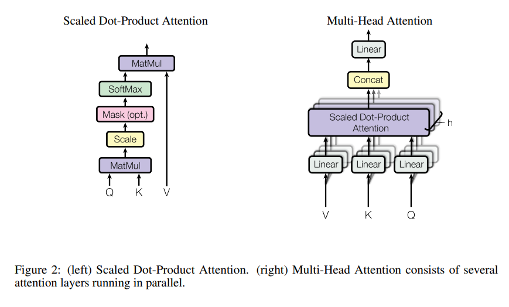

# Attention 的意義

## Attention 的數學式



Attention(Q,K,V) 可以表示为：

$$
\text{Attention}(Q,K,V) = \text{softmax}(\frac{QK^T}{\sqrt{d_k}})V
$$

其中，Q,K,V 分别表示查询矩阵、键矩阵和值矩阵，softmax 表示对矩阵中每一行进行 softmax 归一化， $sqrt(d_k)$  是一个缩放因子， $d_k$ 表示键矩阵 K 的维度。注意，这里的 Q,K,V 通常是通过线性变换得到的。

该公式表示了 Attention 机制的基本形式，它将查询矩阵 Q 与键矩阵 K 相乘得到一个相关性矩阵，然后对其进行 softmax 归一化，得到注意力权重矩阵，最后将其与值矩阵 V 相乘得到输出矩阵。通过这个过程，Attention 机制可以自适应地计算不同输入之间的相关性，从而实现了在处理序列数据时的自动特征提取和信息融合。

## Attention 的直覺意義

熟悉 JavaScript 的人一定知道 JSON

JSON 這樣的結構很有用，例如當作英翻中的字典

```js
{
    dog:'狗',
    cat:'貓',
    a:'一隻',
    the:'這隻',
    eat:'吃',
    chase:'追'
}
```

或者記錄結構

```js
{
    name:'陳鍾誠',
    age:53,
    gender:'男',
    friends: ['Snoopy', 'Tim'],
}
```

JSON 裡的結構都是像這樣

```js
{
    key1:value1,
    key2:value2,
    ...
}
```

Attention 中的 key, value 也是這個意義，用 key 來提取出 value 。

但是現在到底應該提取那些 value 出來呢？這就是靠 query 決定了。

$$
\text{Attention}(Q,K,V) = \text{softmax}(\frac{QK^T}{\sqrt{d_k}})V
$$

上述公式的意思，就是用 Q (query) 去找出相關的 K (key)，然後再用這些 K (key) 取出對應的 V (value) 丟出去。

但要注意的是，Q, K, V 的實作是 Linear 全連接層，所以其實是像相關係數那樣的，兩兩之間都有相關，於是會有 `W[q,k]` 這樣的二維權重參數。

```py
import torch
import torch.nn as nn

class Attention(nn.Module):
    def __init__(self, hidden_dim):
        super(Attention, self).__init__()
        self.hidden_dim = hidden_dim
        self.attn_weights = nn.Linear(hidden_dim, 1, bias=False)
        self.W_q = nn.Linear(hidden_dim, hidden_dim, bias=False)
        self.W_k = nn.Linear(hidden_dim, hidden_dim, bias=False)
        self.W_v = nn.Linear(hidden_dim, hidden_dim, bias=False)
        
    def forward(self, encoder_outputs, hidden_state):
        # encoder_outputs: [batch_size, seq_len, hidden_dim]
        # hidden_state: [batch_size, hidden_dim]
        
        Q = self.W_q(hidden_state).unsqueeze(1)
        K = self.W_k(encoder_outputs)
        V = self.W_v(encoder_outputs)
        
        attn_scores = torch.matmul(Q, K.transpose(1, 2))
        attn_scores = torch.softmax(attn_scores, dim=-1)
        context = torch.matmul(attn_scores, V)
        context = context.squeeze(1)
        # context: [batch_size, hidden_dim]
        
        return context, attn_scores

```

## Attention 的細節

首先，对于一个输入序列 $X = (x_1, x_2, ..., x_n)$，我们可以将其表示为 $d$ 维向量的集合，即 $X \in \mathbb{R}^{n \times d}$。

假设 $q_i, k_j, v_j$ 分别表示 $x_i, x_j, x_j$ 映射到的 $d$ 维向量，其中 $i,j \in \{1,2,...,n\}$。

则，通过计算 $q_i$ 与所有 $k_j$ 的相似度得到一个分数 $s_{i,j}$，表示 $x_i$ 与 $x_j$ 的相关性：

$$
s_{i,j} = q_i \cdot k_j
$$

其中， $\cdot$ 表示向量的点积。

接下来，通过对这些分数进行归一化处理，得到 $x_i$ 与所有 $x_j$ 的权重 $a_{i,j}$：

$$
a_{i,j} = \frac{\exp(s_{i,j})}{\sum_{j=1}^{n}\exp(s_{i,j})}
$$

其中， $\exp$ 表示自然指数函数。

最后，通过对所有 $v_j$ 与对应的权重 $a_{i,j}$ 进行加权求和，得到最终的输出向量 $o_i$：

$$
o_i = \sum_{j=1}^{n}a_{i,j}v_j
$$

这个过程就是 Attention 机制的本质，它通过自适应地计算不同输入之间的相关性，将重要的信息聚合到一个向量中，从而实现了在处理序列数据时的自动特征提取和信息融合。
