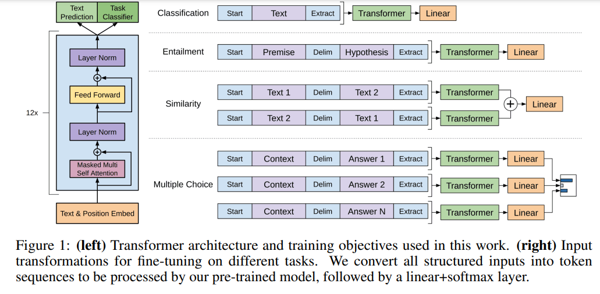

# 第五章 GPT

* [Karpathy Youtube: Let's build GPT: from scratch, in code, spelled out.](https://www.youtube.com/watch?v=kCc8FmEb1nY)
* [Large Language Models from scratch 1 (動畫超讚)](https://www.youtube.com/watch?v=lnA9DMvHtfI)
* [Large Language Models from scratch 2 (動畫超讚)](https://www.youtube.com/watch?v=YDiSFS-yHwk)

ccc: 

我以為 GPT 是用 MLM + NSP 當 loss，結果搞錯了
BERT 才是 MLM + NSP 

GPT1 除語言模型外，有4 種 Task (Refined Task)
1. Classification
2. Entailment
3. Similarity 
4. Multiple Choice

GPT 的語言模型是用 n-gram 的馬可夫模型， P(x[t] | x[t-1], ... x[t-n])
...

1. https://paperswithcode.com/method/gpt
    * OpenAI GPT1: [Improving Language Understanding by Generative Pre-Training](https://gwern.net/doc/www/s3-us-west-2.amazonaws.com/d73fdc5ffa8627bce44dcda2fc012da638ffb158.pdf)
    * OpenAI GPT2: [Language Models are Unsupervised Multitask Learners](https://cdn.openai.com/better-language-models/language_models_are_unsupervised_multitask_learners.pdf)
    * OpenAI GPT3: [Language models are few shot learners) ](https://arxiv.org/pdf/2005.14165.pdf)
2. [The Journey of Open AI GPT models](https://medium.com/walmartglobaltech/the-journey-of-open-ai-gpt-models-32d95b7b7fb)



## 5.1 GPT的發展史

GPT（Generative Pre-trained Transformer）是由OpenAI開發的一種基於Transformer模型的自然語言生成模型。GPT系列模型的發展歷程如下：

1. GPT-1：於2018年6月發布，是一種基於Transformer的單向語言模型，使用了1.5億個參數。在多個自然語言處理任務上取得了極好的表現。

2. GPT-2：於2019年2月發布，使用了15億個參數。相較於GPT-1，GPT-2在多個自然語言生成任務上表現更好，例如生成文章、對話等。然而，由於GPT-2過於強大，OpenAI決定不公開釋出完整模型，只公開了部分模型和生成的文本樣例，以免被惡意濫用。

3. GPT-3：於2020年6月發布，使用了1750億個參數。GPT-3是當時最大的語言模型，可用於多種自然語言處理任務，例如語言生成、語言理解等。GPT-3具有強大的通用性，可以完成許多不同的任務，而不需要進行任何特定任務的微調。它在自然語言生成方面的表現，甚至讓人感到模型似乎已經能夠理解語言的本質。

隨著GPT系列模型的不斷發展，它們的參數量越來越大，表現也越來越出色，並且在各種自然語言處理任務上取得了極好的表現。

## 5.2 GPT的基本結構

GPT的基本結構是一個基於Transformer的語言模型。這個模型由多個Transformer編碼器堆疊而成，每個編碼器都由多個注意力頭和前向神經網絡組成。下面是GPT的基本結構：

1. 輸入嵌入層：GPT首先將輸入的文本序列進行嵌入處理，轉換成一個固定維度的向量表示。

2. Transformer編碼器：GPT由多個Transformer編碼器堆疊而成，每個編碼器包含了多個注意力頭和前向神經網絡。這些編碼器在整個模型中負責將輸入序列轉換成隱藏表示，並捕捉到輸入序列中的上下文信息。

3. 位置編碼：為了區分不同位置的單詞，GPT還引入了位置編碼，將每個單詞的位置信息添加到它的嵌入向量中。

4. Softmax層：最後，GPT使用一個softmax層來生成模型的輸出，該層將模型的隱藏表示轉換為一個概率分佈，用於預測下一個可能的單詞。

總體而言，GPT的基本結構就是一個由多個Transformer編碼器組成的語言模型，通過多層堆疊的方式捕捉輸入序列的上下文信息，並使用softmax層生成模型的輸出。

## 5.3 GPT的訓練方法

GPT的訓練方法是使用無監督學習的方式，通過最大化語言模型的似然概率來學習文本的分布特徵，從而使模型學習到自然語言的結構和規律。

具體來說，GPT的訓練方法可以分為以下步驟：

1. 資料準備：首先，需要從大量的文本數據中提取出輸入序列和對應的輸出序列，其中輸入序列通常是一個定長的文本片段，而輸出序列則是輸入序列的下一個單詞。通常使用n-gram模型或者滑動窗口的方法來提取輸入序列和對應的輸出序列。

2. 模型訓練：使用輸入序列預測輸出序列的過程就是GPT的訓練過程。在訓練過程中，首先將輸入序列傳入模型中，經過多個Transformer編碼器的處理後，生成模型的預測輸出序列。然後將預測輸出序列與實際輸出序列進行比較，計算模型預測的似然概率。最終，使用反向傳播算法將損失函數的梯度傳回模型，更新模型的參數。

3. 超參數調整：GPT的訓練需要調整多個超參數，包括學習率、訓練批次大小、編碼器層數、注意力頭數、隱藏維度等。通常使用網格搜索或隨機搜索等方法進行超參數的調整，以獲得最佳的訓練效果。

4. 評估：為了評估GPT的訓練效果，需要使用測試集進行測試。通常使用困惑度(perplexity)等指標來評估模型的性能，困惑度越低代表模型的性能越好。

總體而言，GPT的訓練方法是使用無監督學習的方式，通過最大化語言模型的似然概率來學習文本的分布特徵，並通過調整超參數來獲得最家預測的方法。

## 5.4 Python + Pytorch實現

ccc: 算了，我覺得 ChatGPT 在亂寫，就別貼了 ....

後來我用問答的方式，得到很好的結果，請參考下列文章：

* [A3-向ChatGPT學GPT](A3-向ChatGPT學GPT.md)

然後就可以跑下列程式專案

* https://github.com/graykode/gpt-2-Pytorch

或直接看 colab 的結果

* https://colab.research.google.com/github/graykode/gpt-2-Pytorch/blob/master/GPT2_Pytorch.ipynb

## 呼叫 GPT

1. pipeline for text generation

```py
from transformers import pipeline, set_seed
generator = pipeline('text-generation', model='gpt2')
set_seed(42)
generator("Hello, I'm a language model,", max_length=30, num_return_sequences=5)
```

2. Get the features of a given text in PyTorch:

```py
from transformers import GPT2Tokenizer, GPT2Model
tokenizer = GPT2Tokenizer.from_pretrained('gpt2')
model = GPT2Model.from_pretrained('gpt2')
text = "Replace me by any text you'd like."
encoded_input = tokenizer(text, return_tensors='pt')
output = model(**encoded_input)

```
