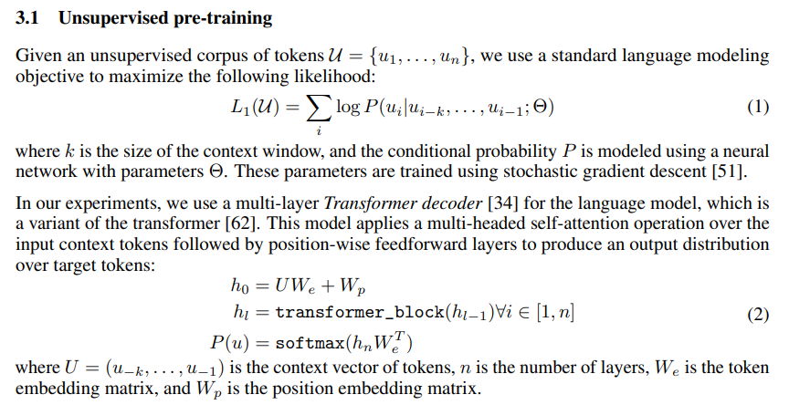
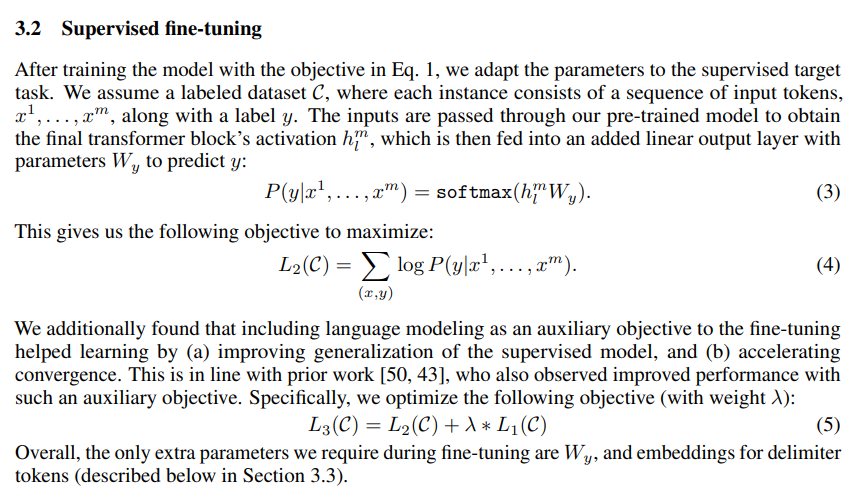

# GPT1

* OpenAI GPT1: [Improving Language Understanding by Generative Pre-Training](https://gwern.net/doc/www/s3-us-west-2.amazonaws.com/d73fdc5ffa8627bce44dcda2fc012da638ffb158.pdf)

## 實作

* https://huggingface.co/docs/transformers/model_doc/openai-gpt

## ccc: 請說明 GPT 1 模型的原理

GPT-1（Generative Pre-trained Transformer 1）是一個基於Transformer架構的自然語言處理模型。它的原理可以分為兩個主要部分：預訓練和微調。

在預訓練階段，GPT-1通過大規模的無監督學習從海量的文本數據中學習語言模型，從而使得模型能夠對語言的規律和潛在含義進行建模。具體地，GPT-1使用了一種叫做“遮蔽語言模型”（Masked Language Model, MLM）的方法，通過隨機遮蔽文本序列中的某些單詞，讓模型學習根據上下文預測被遮蔽的單詞。這樣的遮蔽方式可以讓模型更好地學習單詞之間的上下文關係，進而提高模型的語言理解能力。預訓練階段中的模型是單向的，只能使用前面的單詞來預測下一個單詞。

在微調階段，GPT-1通過在有標註的文本數據上進行有監督學習，將預訓練好的語言模型轉化為具體的自然語言處理應用。具體地，微調階段通常包括將預訓練模型的最後一層或幾層替換為新的分類層，然後在標註的數據集上進行訓練。這樣可以讓模型針對具體任務進行微調，並且通過反向傳播算法來更新模型的參數，從而提高模型在該任務上的表現。

總的來說，GPT-1模型通過預訓練和微調兩個階段的學習，實現了對大量自然語言數據的深度學習，並且在各種自然語言處理任務中取得了良好的效果。

