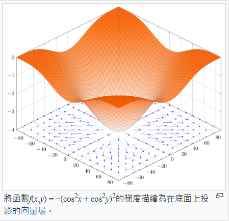

# 微分與梯度

* [深度學習的數學核心 (從微分到梯度下降法) (ipynb)](https://colab.research.google.com/drive/1R6zgKCVBe2HfTUR__NOXCuvToRbBTftZ?usp=sharing#scrollTo=fAx8-JfDgtVY)

## 微分

* [Wikipedia:微分](https://zh.wikipedia.org/zh-tw/%E5%BE%AE%E5%88%86)


$$
\frac{df(x)}{dx} = \lim_{h \to 0} \frac{f(x+h)-f(x)}{h}
$$

```py
def f(x):
    # return x*x
    return x**3

dx = 0.001

def diff(f, x):
    df = f(x+dx)-f(x)
    return df/dx

print('diff(f,2)=', diff(f, 2))
```

執行結果

```
$ python diff.py
diff(f,2)= 12.006000999997823
```

更多範例

```py
def square(x):
    return x*x

def power3(x):
    return x*x*x

def triple(x):
    return 3*x

dx = 0.001

def diff(f, x):
    df = f(x+dx)-f(x)
    return df/dx

print('diff(square,2)=', diff(square, 2))
print('diff(power3,1)=', diff(power3, 1))
print('diff(power3,2)=', diff(power3, 2))
print('diff(triple,1)=', diff(triple, 1))
print('diff(triple,2)=', diff(triple, 2))

```

執行結果

```
$ python diff2.py
diff(square,2)= 4.000999999999699
diff(power3,1)= 3.0030009999995055
diff(power3,2)= 12.0060009999996
diff(triple,1)= 2.9999999999996696
diff(triple,2)= 3.0000000000001137
```

## 偏微分

偏微分是对多元函数中的一个自变量进行求导，保持其他自变量不变。偏微分的定义类似于单变量函数中的导数，只不过在多元函数中需要对每个自变量分别求导。

假设 $f(x_1, x_2, \ldots, x_n)$ 是一个 $n$ 元函数，则对于其中的一个自变量 $x_i$，在点 $(a_1, a_2, \ldots, a_n)$ 处的偏导数 $\frac{\partial f}{\partial x_i}$ 定义为：

$$ \frac{\partial f}{\partial x_i}\Bigg|{(a_1, a_2, \ldots, a_n)} = \lim{h\to 0} \frac{f(a_1, a_2, \ldots, a_i+h, \ldots, a_n) - f(a_1, a_2, \ldots, a_n)}{h} $$

其中，$h$ 表示对自变量 $x_i$ 进行微小变化的增量。偏微分表示在函数图像中，以一个坐标轴为基准线，沿着该基准线方向的变化率。

类似于单变量函数中的导数，偏微分也可以表示为函数在该点处的切线斜率，用来描述函数在该点上沿着某个自变量方向的变化率。在实际应用中，偏微分在计算机图形学、物理学、金融等领域中具有广泛的应用。

```py
step = 0.01

# 我們想找函數 f 的最低點
def f(p):
    [x,y] = p
    return x * x + y * y

# df(f, p, k) 為函數 f 對變數 k 的偏微分: df / dp[k]
# 例如在上述 f 範例中 k=0, df/dx, k=1, df/dy
def df(f, p, k):
    p1 = p.copy()
    p1[k] += step
    return (f(p1) - f(p)) / step

# 函數 f 在點 p 上的梯度
def grad(f, p):
    gp = p.copy()
    for k in range(len(p)):
        gp[k] = df(f, p, k)
    return gp

[x,y] = [1,3]
print('x=', x, 'y=', y)
print('df(f(x,y), 0) = ', df(f, [x, y], 0))
print('df(f(x,y), 1) = ', df(f, [x, y], 1))
print('grad(f)=', grad(f, [x,y]))

```

執行結果

```
$ python vecGradient.py
x= 1 y= 3
df(f(x,y), 0) =  2.009999999999934
df(f(x,y), 1) =  6.009999999999849
grad(f)= [2.009999999999934, 6.009999999999849]
```

## 梯度

如前所述，《梯度》的數學定義如下：

$$
\nabla_{x} f(x) = \left[ \frac{\partial }{\partial x_1} f(x), \frac{\partial }{\partial x_2} f(x),\cdots,\frac{\partial }{\partial x_n} f(x) \right]^T=\frac{\partial }{\partial{x}} f(x)
$$

問題是、這樣的數學符號對程式人有點可怕，到底梯度有甚麼直覺意義呢？讓我們看看下圖：




其實梯度就是斜率最大的那個方向，所以梯度下降法，其實就是朝著斜率最大的方向走。

