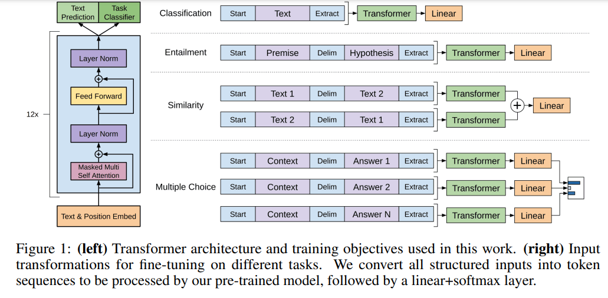

# 向ChatGPT學GPT


* ccc: GPT 的第一篇論文 (OpenAI)
    * [Improving Language Understanding
by Generative Pre-Training](https://gwern.net/doc/www/s3-us-west-2.amazonaws.com/d73fdc5ffa8627bce44dcda2fc012da638ffb158.pdf)



論文 2: [The Illustrated GPT-2 (Visualizing Transformer Language Models)](http://jalammar.github.io/illustrated-gpt2/)

## ccc: 你能用 pytorch 內建模組，寫一個精簡的 GPT 框架，並說明其意義嗎？

ChatGPT:

是的，我們可以使用 PyTorch 內建的模組搭建一個精簡的 GPT 框架。以下是一個簡單的範例，以及對其中的每個組件的解釋：

```py
import torch
import torch.nn as nn

class GPT(nn.Module):
    def __init__(self, vocab_size, embedding_dim, num_layers, num_heads, hidden_dim, seq_length, dropout=0.1):
        super().__init__()

        self.embedding = nn.Embedding(vocab_size, embedding_dim)
        self.positional_encoding = nn.Parameter(torch.zeros(1, seq_length, embedding_dim))
        self.layers = nn.ModuleList([
            nn.TransformerEncoderLayer(embedding_dim, num_heads, hidden_dim, dropout)
            for _ in range(num_layers)
        ])
        self.dropout = nn.Dropout(dropout)
        self.fc = nn.Linear(embedding_dim, vocab_size)

    def forward(self, x):
        x = self.embedding(x) + self.positional_encoding
        x = x.permute(1, 0, 2)
        for layer in self.layers:
            x = layer(x)
        x = x.permute(1, 0, 2)
        x = self.fc(x)
        return x

```

* nn.Embedding：嵌入層，將整數表示的詞彙轉換為密集向量表示。
* nn.Parameter：一種特殊的張量，被認為是模型參數。在這裡，它用於儲存位置編碼。
* nn.TransformerEncoderLayer：一個單獨的 Transformer 編碼器層，由多頭注意力和前向網絡組成。
* nn.ModuleList：將多個編碼器層包裝成一個列表，使其能夠在 forward 方法中迭代。
* nn.Dropout：實現輸入元素的隨機失活，以避免過度擬合。
* nn.Linear：線性層，用於最終預測下一個詞彙的機率。

在 forward 方法中，模型的操作流程如下：

* 將整數表示的詞彙嵌入到密集向量表示中。
* 加上位置編碼，以考慮單詞在序列中的位置。
* 將 batch 維度移動到第二個位置，以適應 PyTorch 內建的多頭注意力操作。
* 通過多個 Transformer 編碼器層進行預測，以獲得下一個詞彙的機率分布。
* 將 batch 維度移回到第一個位置。
* 通過線性層對每個詞彙進行打分，得到最終的預測結果。

## ccc: 嵌入層 nn.Embedding 是如何將詞彙轉成密集向量表示的？

ChatGPT:

nn.Embedding 是 PyTorch 中的一個模組，用於將詞彙轉換為密集向量表示。假設我們的詞彙表大小為 $V$，每個詞彙用一個唯一的整數表示，取值範圍從 $0$ 到 $V-1$，那麼 nn.Embedding 將會建立一個大小為 $V \times d$ 的權重矩陣，其中 $d$ 為所需的向量維度。

當輸入一個整數序列時，nn.Embedding 會查找該序列中每個整數所對應的權重，並將它們串聯起來形成一個新的 $N \times L \times d$ 的張量，其中 $N$ 為輸入的 batch size，$L$ 為序列長度。換句話說，nn.Embedding 將整數序列轉換成為一個浮點數序列，其中每個浮點數向量表示一個詞彙。

這種轉換方式具有一定的優勢，例如：

* 可以捕捉詞彙之間的相似性和關聯性，並將它們嵌入到連續的向量空間中。
* 可以在神經網絡的運行過程中，學習到詞彙之間的關係，並且能夠在類似詞彙之間進行插值、線性運算等操作，從而獲得更好的表現。

總之，nn.Embedding 是自然語言處理任務中不可或缺的一個模組，它提供了一種有效的方法，將離散的詞彙轉換成密集的向量表示，為後續的神經網絡處理打下基礎。

## ccc: self.positional_encoding = nn.Parameter(torch.zeros(1, seq_length, embedding_dim)) 這行的意義是甚麼?

ChatGPT:

這行程式碼是在建立一個可學習的位置編碼（positional encoding）矩陣，用來捕捉輸入序列中詞語的位置信息。它是基於 Transformer 模型中的一種位置編碼方法，其目的是為了讓 Transformer 在處理序列資料時能夠捕捉到詞語之間的相對位置信息。

在這裡，nn.Parameter 是一個可以被訓練的參數，因此 self.positional_encoding 是一個可以被學習的形狀為 (1, seq_length, embedding_dim) 的張量。在這個張量中，第一個維度 1 表示它只有一個通道（channel），因為位置編碼是與每個詞向量相加的。第二個維度 seq_length 表示序列的長度，第三個維度 embedding_dim 則表示詞向量的維度。初始化時，位置編碼張量被填充為全零，模型在訓練過程中會學習到合適的位置編碼。

## ccc:

請解釋下列程式碼

```py
        self.layers = nn.ModuleList([
            nn.TransformerEncoderLayer(embedding_dim, num_heads, hidden_dim, dropout)
            for _ in range(num_layers)
        ])
```

ChatGPT:

這段程式碼是 GPT 模型的一個關鍵部分，它定義了一個包含多個 Transformer 編碼器層的列表。

具體地說，nn.ModuleList 是一個用於存儲 PyTorch 模型的列表容器，其中的每個元素都是一個 nn.Module。在這個例子中，self.layers 是一個 nn.ModuleList，其中的每個元素都是一個 nn.TransformerEncoderLayer。

nn.TransformerEncoderLayer 是一個編碼器層，它實現了 Transformer 模型中的一個編碼器。它包含一些子層，如多頭注意力層、前向傳播層和殘差連接層等，通過這些子層對輸入進行處理，從而得到編碼器的輸出。在這個例子中，nn.TransformerEncoderLayer 的輸入維度是 embedding_dim，多頭注意力層的頭數是 num_heads，前向傳播層的隱藏層維度是 hidden_dim，隨機丟棄率是 dropout。

通過這段程式碼，我們創建了 num_layers 個編碼器層，它們都具有相同的結構和參數。這些編碼器層將按照它們在列表中出現的順序進行串聯，從而構成了整個 GPT 模型的編碼器部分。

## ccc: x = x.permute(1, 0, 2) 這行的作用是甚麼?

ChatGPT:

這行程式碼的作用是改變張量的維度順序。在 GPT 模型的 forward 函數中，這行程式碼被用於將張量 x 的維度從 (batch_size, seq_length, embedding_dim) 改為 (seq_length, batch_size, embedding_dim)。這是因為 Transformer 模型的多頭注意力層和前向傳播層需要將張量的第一個維度視為序列的時間步，因此需要先將 batch_size 和 seq_length 的位置交換。

具體地說，x.permute(1, 0, 2) 的作用是將 x 張量的第一個維度和第二個維度進行交換，即將 batch_size 和 seq_length 的位置交換。第三個維度沒有改變，仍然是 embedding_dim。因此，最終得到的張量的形狀是 (seq_length, batch_size, embedding_dim)。

在 forward 函數中，這行程式碼被用於在進行 Transformer 編碼器層的運算之前，將張量 x 的維度進行轉換。在進行完 Transformer 編碼器層的運算之後，還需要再次使用 x.permute(1, 0, 2) 將張量的維度改回原來的形狀，以便繼續後續的計算。

## ccc: 所以 GPT 只用到了 TransformerEncoderLayer ，但是沒有用到 Decoder Layer ，為甚麼?

ChatGPT:

GPT 模型只使用了 Transformer 的 Encoder 部分，沒有使用到 Decoder 部分的原因是因為 GPT 模型的設計目標是生成自然語言文本，並不需要進行序列到序列的翻譯任務。在自然語言生成任務中，模型的輸入序列和輸出序列的長度是相等的，因此只需要使用 Transformer 的 Encoder 部分對輸入序列進行編碼，然後通過一個全連接層將編碼後的向量映射到目標詞彙表中的概率分佈，從而實現生成文本的任務。

相反，在序列到序列的翻譯任務中，模型需要將輸入序列編碼成一個固定長度的向量，然後再將該向量解碼成與輸出序列等長的目標序列。在這種情況下，需要使用 Transformer 的 Encoder 部分對輸入序列進行編碼，並且還需要使用 Transformer 的 Decoder 部分對已生成的目標序列進行解碼，從而得到輸出序列。因此，這種情況下需要使用 Transformer 的 Encoder 和 Decoder 部分。

總之，GPT 模型只使用 Transformer 的 Encoder 部分是因為其任務特性和設計目標所決定的。